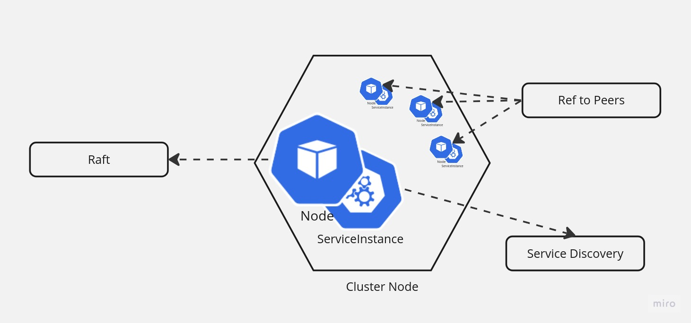

[![Crates.io][crates-badge]][crates-url]
[![MIT licensed][mit-badge]][mit-url]

## Cluster Mode
Create and manage distributed applications in Rust.

Built with the motto - *Plug the crate in, it'll be taken care of.*

## Usage
```rust
#[tokio::main]
async fn main() {
    let result = KubernetesDiscoverService::init("demo".to_string(), "default".to_string())
        .await;
    if let Ok(k8s) = result {
        let cluster = Arc::new(Cluster::default());
        let client = DiscoveryClient::new(k8s);
        tokio::spawn(start_cluster(cluster, client));
    }
}
```
The `Cluster` struct provides a set of functions for example `async fn primaries(&self) -> Option<HashSet<RestClusterNode>>` 
or `async fn is_active(&self) -> bool` to communicate with the cluster.

Checkout [doc.rs][doc-cluster-mode-cluster]

## How Cluster Mode works

`cluster-mode` handles three components -
* Service Discovery
* Consensus(Raft) 
* The Cluster

TODO: change to flowchart



### Service Discovery
It uses [rust-cloud-discovery] crate to discover nodes, each node represented by type `ServiceInstance`. Given a valid implementation of the 
crate, cluster-mode should be able to handle the addition of a new node or termination of an 
existing or unreachable node.

Check [rust-cloud-discovery] for available implementations.

### Consensus
The main hurdle of a distributed system is consensus. For that, we're using [almost-raft]; the crate
handles leader election only, once enough is discovered by the discovery service.

Note that, `cluster-mode` supports only a single primary, a limitation imposed by `almost-raft`. 
Also, it doesn't handle log consistency; it's up to the developer how to maintain consistency.

Hoping to add these features in the future.

### The Cluster
`cluster-mode` initialises the cluster in `Inactive` state. Then works hand to hand with the
discovery service & the consensus algorithm to elect primary and secondaries. The crate tries to 
maintain a consistent set of secondaries & secondaries and provide a set of APIs enabling 
developers to work with the cluster.

[rust-cloud-discovery]: https://crates.io/crates/rust-cloud-discovery
[doc-cluster-mode]: https://docs.rs/cluster-mode
[doc-cluster-mode-cluster]: https://docs.rs/cluster-mode/latest/cluster-mode/struct.Cluster.html
[almost-raft]: https://crates.io/crates/almost-raft
[crates-badge]: https://img.shields.io/crates/v/cluster-mode.svg
[crates-url]: https://crates.io/crates/cluster-mode
[mit-badge]: https://img.shields.io/badge/license-MIT-blue.svg
[mit-url]: https://github.com/tokio-rs/tokio/blob/master/LICENSE